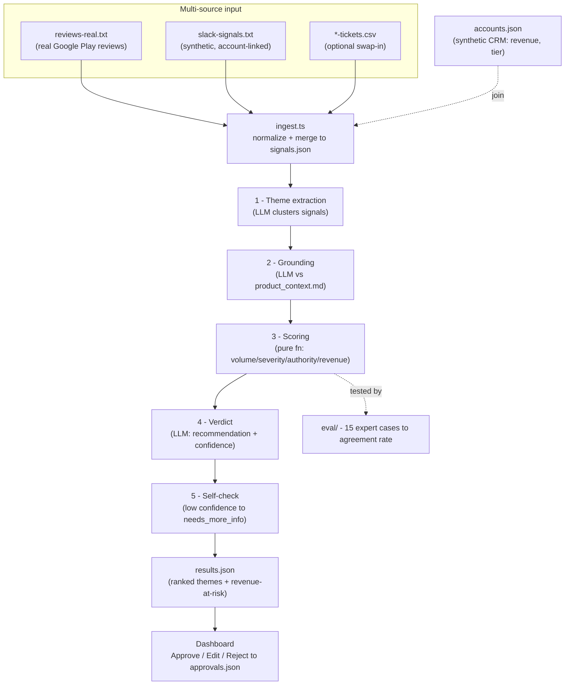

# Voice of Customer Agent

An agentic tool that turns raw, multi-source product feedback into a ranked,
decision-ready list of **what to build next** — weighting each theme by *who*
raised it and *what account it's worth*, grounding it against the team's real
constraints and roadmap, and putting a human in the loop before anything is
final.

> A crash reported in three anonymous app reviews might not be the signal; the
> same crash flagged in `#sales-signals` as blocking a $2M renewal is critical.
> The system tells the difference because it reads the message **and looks up
> the account behind it.**

Case study: **TaskFlow**, a project-management SaaS deciding what to fix this
quarter for its at-risk enterprise accounts — run on **real** app-store reviews.

---

## What it does

1. **Ingests** feedback from multiple, mismatched sources (real app-store
   reviews + synthetic internal Slack signals + optional support-ticket CSVs)
   and normalizes them into one schema.
2. Runs a **multi-step LLM pipeline** (Claude) that clusters signals into themes,
   grounds each against a product-context file, scores it, and renders a verdict.
3. **Prioritizes** with a transparent, inspectable formula that weights source
   authority and revenue-at-risk — not just raw complaint volume.
4. Puts a **human in the loop**: a dashboard with a full score breakdown and
   Approve / Edit / Reject controls. Nothing is final until a person approves it.
5. **Evaluates** the prioritization against 15 hand-labeled expert cases and
   reports an honest agreement rate.

Every headline number is **computed from the data and the code** — see
`results.json` and `eval/results.json`.

---

## Architecture



Each step is a separate module (`src/pipeline/`), and every step's input/output
is logged to `runs/<timestamp>/` so a full run is auditable.

---

## The scoring formula (the part that matters)

Prioritization is a **pure, inspectable function** (`src/pipeline/3-score.ts`) —
no LLM, so it's testable and an interviewer can read exactly why a theme ranked
where it did. Weights live in `config.ts` and are tunable.

```
priority = w_vol  * volume_norm      (log-scaled signal count, normalized)
         + w_sev  * severity_norm    (1-5 severity / 5)
         + w_auth * authority_weight (mean source-authority of the signals)
         + w_rev  * revenue_norm     (revenue-at-risk, normalized)
```

- **Source authority** (`config.ts → SOURCE_AUTHORITY`): a sales-call note (1.0)
  or paying-customer ticket (0.85) outranks an anonymous app review (0.35).
- **Revenue-at-risk** = sum of `annual_revenue` over the **distinct accounts**
  whose signals feed the theme. **Anonymous app reviews contribute no revenue** —
  only identified sources (Slack, tickets) join to the CRM. That's the whole
  point: volume alone doesn't win.

**Revenue-at-risk surfaced** (the headline number) = sum of revenue-at-risk
across themes whose verdict is `pursue`, written to `results.json`.

Default weights: volume 0.20, severity 0.25, authority 0.20, revenue 0.35.

---

## Data & attribution

VoC input is never one clean table, so the dataset is deliberately mixed:

| Source | File | Real/synthetic | Account-linked? |
|---|---|---|---|
| App-store reviews | `data/sources/reviews-real.txt` | **Real** — 288 Google Play reviews of Asana & Monday | No (anonymous) |
| Internal Slack | `data/sources/slack-signals.txt` | Synthetic (14) | Yes → CRM |
| CRM accounts | `data/accounts.json` | Synthetic (40) | — |
| Support tickets | `data/sources/*-tickets.csv` | Optional swap-in | Yes → CRM |

**Real reviews** are sourced from the public
[Kimola/nlp-datasets](https://github.com/Kimola/nlp-datasets) repository
(`getting-started/`). They remain the property of their original authors and
platforms; the dataset carries no explicit open license and is used here for a
non-commercial portfolio demonstration with attribution. Internal Slack, CRM
accounts, and the product context are synthetic — real internal/CRM data is
proprietary, so these are plausible stand-ins for a project-management SaaS.

### Swapping in your own real data (e.g. Kaggle)

1. Download a dataset — e.g. Kaggle's
   `suraj520/customer-support-ticket-dataset` — and save the CSV as
   `data/sources/<name>-tickets.csv`.
2. It needs a text column named `text`, `Content`, `Ticket Description`, or
   `description`. The ingester picks it up automatically, tags each row as a
   `support_ticket`, and assigns it to a CRM account (a demo stand-in for the
   real ticket-to-account link).
3. Re-run `npm run generate` then `npm run pipeline`.

---

## How to run

```bash
npm install

# 1. Build the merged dataset (real reviews + synthetic Slack + CRM). No key needed.
npm run generate

# 2. Run the agentic pipeline. Needs a Claude API key.
cp .env.example .env          # then paste your key into .env
npm run pipeline              # -> results.json + runs/<timestamp>/ audit trail

# 3. Review + approve in the dashboard.
npm run web                   # -> http://localhost:5173  (Approve/Edit/Reject -> approvals.json)

# 4. Evaluate the prioritization (deterministic, no key).
npm run eval                  # -> eval/results.json
```

Get a key at [console.anthropic.com](https://console.anthropic.com) (API keys
are separate from a Claude.ai subscription; pay-as-you-go). The model is one
config constant — `MODEL` in `config.ts` / `.env` (default `claude-opus-4-8`;
set `claude-sonnet-5` for a cheaper, faster run).

---

## Evaluation

`eval/cases.json` holds **15 hand-labeled cases**, each a small set of candidate
themes plus the priority ordering an expert PM would choose. `eval/run.ts` runs
the real scorer on each and reports **top-1 agreement**, written to
`eval/results.json`.

The labels are set by independent PM judgment, **not** reverse-engineered from
the formula, and two cases are deliberately **adversarial** (a widespread severe
bug vs. a high-revenue low-severity ask) — the boundary where a revenue-weighted
scorer can over-fire. The current result is **13 / 15 (0.87)**; the two
disagreements are reported honestly and are a useful, real limitation to discuss.

---

## How this maps to a production Salesforce stack

This is a design mapping, not a claim of integration — but the architecture
lines up cleanly with a real Salesforce deployment:

- **Agentforce** → the agent runtime. The five pipeline steps
  (extract → ground → score → verdict → self-check) become Agentforce topics /
  actions; the `runs/` audit log maps to Agentforce's action traces.
- **Data Cloud** → the unified customer + revenue layer. `accounts.json` (the
  CRM join that turns a Slack signal into a revenue number) is exactly what Data
  Cloud provides for real — unifying feedback, product usage, and ARR per account.
- **Slack** → the human-in-the-loop surface. The Approve / Edit / Reject
  dashboard maps to a Slack approval flow where a PM signs off on a verdict
  before it's committed — the same "nothing is final until a human approves it"
  gate, where the sales-signal often originates.

---

## Project layout

```
config.ts               tunable knobs: source weights, scoring coeffs, model
product_context.md      constraints + roadmap the grounding step reads
data/
  accounts.ts           synthetic CRM generator
  ingest.ts             multi-source wrangling -> signals.json
  generate.ts           orchestrator (accounts + signals)
  sources/              reviews-real.txt, slack-signals.txt (+ your CSVs)
src/
  llm.ts                Claude client: retries, streaming, structured output
  pipeline/1..5         the five agent steps
  run.ts                orchestrator -> results.json + runs/<ts>/
web/                    Vite + React dashboard (human-in-the-loop)
eval/                   15 expert cases + agreement-rate harness
```
